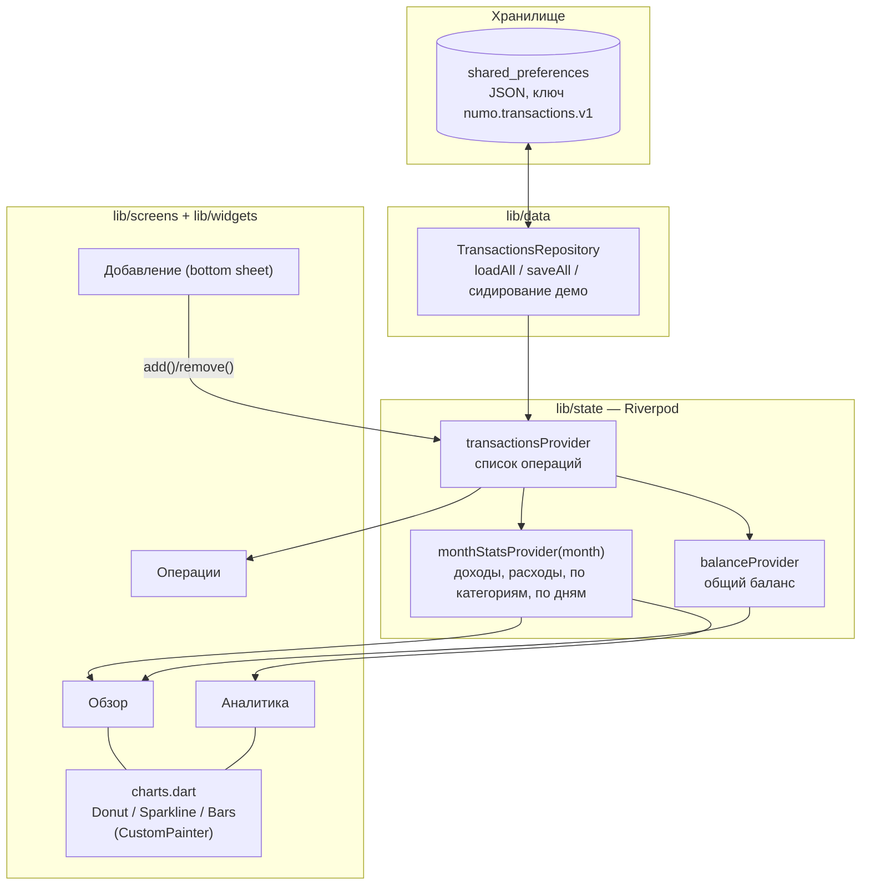

# Архитектура Numo

Однонаправленный поток данных: хранилище → состояние → UI. Никаких обходных путей — UI никогда не пишет в хранилище напрямую.

## Слои

| Слой | Код | Ответственность |
|---|---|---|
| Модели | `lib/models/` | `Tx` (операция: тип, положительная сумма, категория, дата, заметка), `TxCategory` (фиксированный набор в `Categories`) |
| Данные | `lib/data/repository.dart` | Сериализация JSON ↔ `Tx`, единственная точка I/O, демо-сидирование первого запуска |
| Состояние | `lib/state/providers.dart` | `TransactionsNotifier` (add/remove с записью в репозиторий), производная аналитика месяца |
| UI | `lib/screens/`, `lib/widgets/` | Экраны без бизнес-логики; графики — собственные `CustomPainter` |
| Ядро | `lib/core/` | Тема (`NumoColors`, `NumoTheme`), форматирование денег |

## Ключевые инварианты

1. `Tx.amount > 0` всегда; знак несёт `TxType` (`signedAmount` — единственное место, где появляется минус).
2. Схема хранения версионируется ключом (`...v1`); изменение формата = новый ключ + миграция.
3. Провайдеры пересчитывают статистику из полного списка операций — кэшей, требующих инвалидации, нет.

## Осознанные упрощения MVP (см. ADR)

- Хранилище — JSON в shared_preferences, а не SQLite: объёмы данных малы, интерфейс репозитория позволяет мигрировать на drift без изменения UI (ADR-0003).
- Категории фиксированы в коде; пользовательские категории потребуют вынести их в хранилище.
- Один счёт, одна валюта (₽).
