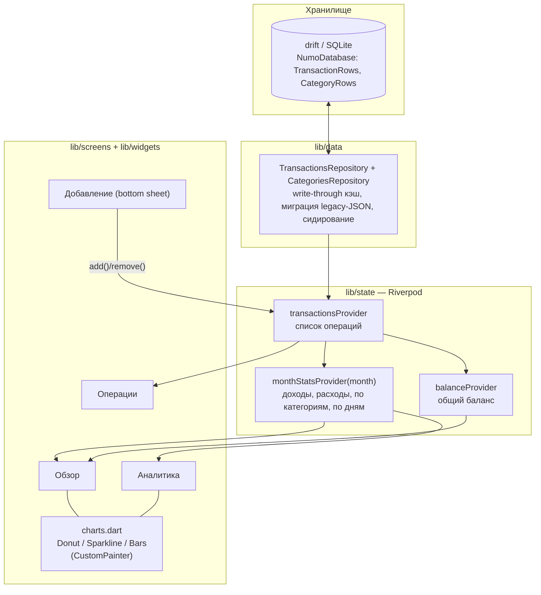

# Архитектура Numo

Однонаправленный поток данных: хранилище → состояние → UI. Никаких обходных путей — UI никогда не пишет в хранилище напрямую.

## Слои

| Слой | Код | Ответственность |
|---|---|---|
| Модели | `lib/models/` | `Tx` (операция: тип, положительная сумма, категория, дата, заметка), `TxCategory` (фиксированный набор в `Categories`) |
| Данные | `lib/data/` | drift-схема (`database.dart`), репозитории с write-through кэшем — единственные точки I/O, миграция legacy-JSON, демо-сидирование |
| Состояние | `lib/state/providers.dart` | `TransactionsNotifier` (add/remove с записью в репозиторий), производная аналитика месяца |
| UI | `lib/screens/`, `lib/widgets/` | Экраны без бизнес-логики; графики — собственные `CustomPainter` |
| Ядро | `lib/core/` | Тема (`NumoColors`, `NumoTheme`), форматирование денег |

## Ключевые инварианты

1. `Tx.amount > 0` всегда; знак несёт `TxType` (`signedAmount` — единственное место, где появляется минус).
2. Схема БД версионируется `schemaVersion`; изменение схемы = drift-миграция.
3. Провайдеры пересчитывают статистику из полного списка операций — кэшей, требующих инвалидации, нет.

## Осознанные упрощения (см. ADR)

- Репозитории держат write-through кэш и пишут весь набор транзакцией (ADR-0006); пошаговые SQL-операции и индексы появятся вместе с ростом данных.
- Один счёт, одна валюта (₽) — до v0.5 роадмапа.
