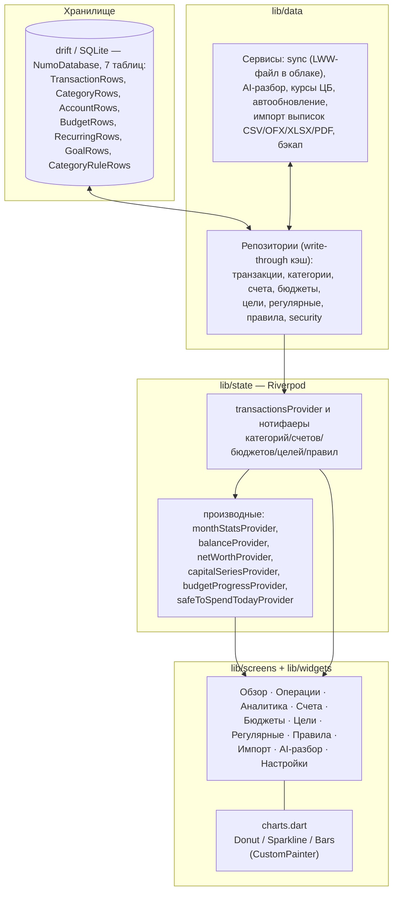

# Архитектура Numo

Однонаправленный поток данных: хранилище → состояние → UI. Никаких обходных путей — UI никогда не пишет в хранилище напрямую.

## Слои

| Слой | Код | Ответственность |
|---|---|---|
| Модели | `lib/models/` | `Tx` (тип, положительная сумма, категория, счёт, дата, заметка), `TxCategory`, `Account` (валюта, вид: обычный/вклад), `Goal`, `RecurringRule`, `CategoryRule` |
| Данные | `lib/data/` | drift-схема (`database.dart`, `schemaVersion` с цепочкой миграций), репозитории с write-through кэшем — единственные точки I/O; сервисы: sync, AI, курсы ЦБ, автообновление, импорт выписок, бэкап |
| Состояние | `lib/state/providers.dart` | Нотифаеры с записью через репозитории; производная аналитика (месяц, баланс, капитал, бюджеты) |
| UI | `lib/screens/`, `lib/widgets/` | Экраны без бизнес-логики; графики — собственные `CustomPainter` |
| Ядро | `lib/core/` | Тема (`NumoColors`, `NumoTheme`), форматирование денег, layout, UI-масштаб, l10n-хелперы |

## Ключевые инварианты

1. `Tx.amount > 0` всегда; знак несёт `TxType` (`signedAmount` — единственное место, где появляется минус).
2. Переводы между счетами и корректировки баланса — системные операции (`Tx.isSystem`): участвуют в балансах счетов, но исключаются из статистики доходов/расходов.
3. Схема БД версионируется `schemaVersion`; изменение схемы = drift-миграция.
4. Провайдеры пересчитывают статистику из полного списка операций — кэшей, требующих инвалидации, нет.
5. Регулярные операции материализуются идемпотентно (детерминированные id + `appliedThrough`): удалённая пользователем сгенерированная операция не возрождается.

## Сеть

Приложение без бэкенда. Все сетевые вызовы перечислены в AGENTS.md (раздел Security) и закреплены ADR: курсы ЦБ (ADR-0007), обновления с GitHub Releases (ADR-0010), LLM-разбор по явному действию пользователя (ADR-0011).

## Осознанные упрощения (см. ADR)

- Репозитории держат write-through кэш; выборки и аналитика — фильтрация в памяти (ADR-0006). Индексы и SQL-выборки появятся вместе с ростом данных.
- Синхронизация — «последняя запись побеждает» целым файлом, без построчного merge (ADR-0008).
